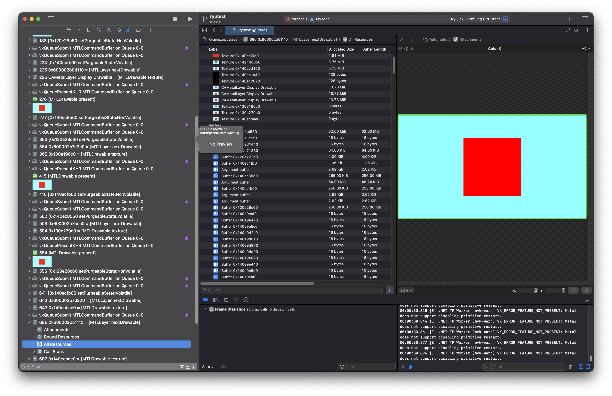

*Written by: [@jcm93](https://github.com/jcm93)*

Below is the method that I have found to produce reliable Metal GPU frame captures of Switch titles in Ryujinx, using Xcode and the lldb debugger. The first draft of this guide will be "quick and dirty;" hopefully, it will be updated continuously so it eventually conforms to best practices, insofar as such a thing can be said to exist in this situation.



## External Build System Project in Xcode

Xcode seems to be more willing to harness an application properly if it's nominally in charge of the entire build process, even if the application isn't using a familiar C-family build toolchain. So we will add Ryujinx as an "External Build System" project, with `dotnet`, our favorite external build system.

1. Clone the Ryujinx github repository as normal: ```git clone https://github.com/ryujinx-mirror/ryujinx```
2. In Xcode, create a New Project. For the template, navigate to "Other", then search for or select "External Build System". For the "Build Tool", provide the location of your `dotnet` installation. For me, this is `/usr/local/share/dotnet/dotnet`. Create the project in any directory you wish; for convenience, you may want to create a folder in your cloned Ryujinx repository named `macos-xcode` or similar.
3. With your project created, for the build Arguments, substitute `build -c debug src/Ryujinx`. For the directory, browse and pick the base directory for your cloned Ryujinx repository that contains the `Ryujinx.sln` file. Uncheck "Pass build settings in environment."
    * *If you have better knowledge of Ryujinx dotnet build arguments, please put whatever here for your preferred Ryujinx build settings. This is just the most minimal way I found to get it building without poring over Ryujinx build scripts.*
4. Optionally, add all project files to the project with "File->Add Files to...", creating folder references and selecting the build target.
5. Build the project.
6. Tell Xcode the binary you want it to debug by navigating to Product->Scheme->Edit Scheme. Under Info, then Executable, select Other.... Then, at the prompt, navigate to your repository folder, then the binary location. In the example from step 3, this would be `<base directory>/src/Ryujinx/bin/Debug/net8.0/Ryujinx`.
7. Also in the Scheme editor, under Options, then "GPU Frame Capture", select "Metal" instead of "Automatically."
8. At this point, Ryujinx should be building properly, and launching and harnessing properly within the Xcode debugger. However, we're not done yet!

## Build Debug MoltenVK

We need a version of MoltenVK compiled with debug symbols. Luckily, building MoltenVK per its documentation is straightforward. Follow its build steps [here](https://github.com/KhronosGroup/MoltenVK/?tab=readme-ov-file#fetching-moltenvk-source-code), making sure you end up building in Debug mode.

> [!NOTE]
> Ryujinx uses an old version of MoltenVK, 1.2.0. Checking out its code at 1.2.0 and building on a current SDK *should* be straightforward. However, I typically opt to build current/main MoltenVK with a one line patch to fix an issue with occlusion queries. That patch is reproduced here: [MoltenVK/MoltenVK/Commands/MVKCommandEncoderState.mm](https://github.com/jcm93/MoltenVK/commit/9639a5b6be9fac19dadeaa07049aaece58ee1cf7#)

With debug MoltenVK in hand, replace the `libMoltenVK.dylib` binary in the `src/Ryujinx/bin/Debug/net8.0/` directory of your Ryujinx repository with the debug .dylib you just built.

## Miscellany

You should now be able to produce frame captures stably within Xcode of Ryujinx titles. To save a capture as a shareable file, use the Export button in the Summary tab. A couple of other notes:
* You will need to tell lldb to ignore `SIGUSR1`; for whatever reason, this pops up everywhere once guest code is loaded. To do so within your current lldb debugger session, just enter ```pro hand -p true -s false SIGUSR1```.
* We did not enter any of the usual "secret sauce" for enabling capture, like adding `Metal Capture Enabled = YES` to the Info.plist file or `MTL_CAPTURE_ENABLE=1` to our environment variables. In my testing, none of these variables actually exposed the option for frame capture in Xcode. Rather, the important determinant in the option being enabled was what we did in Step 7. If you better integrate Ryujinx's build scripts, these other options might come into play more.
* The usual caveats for Ryujinx debugging apply. Mainly, if we aren't using the Hypervisor, we need to use the Software memory mode, or else hit segfaults nearly instantly in guest code.
